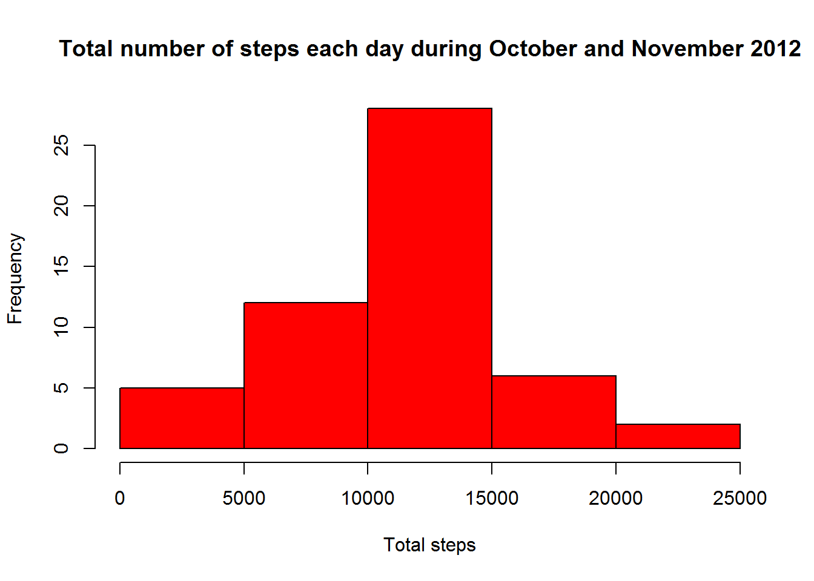
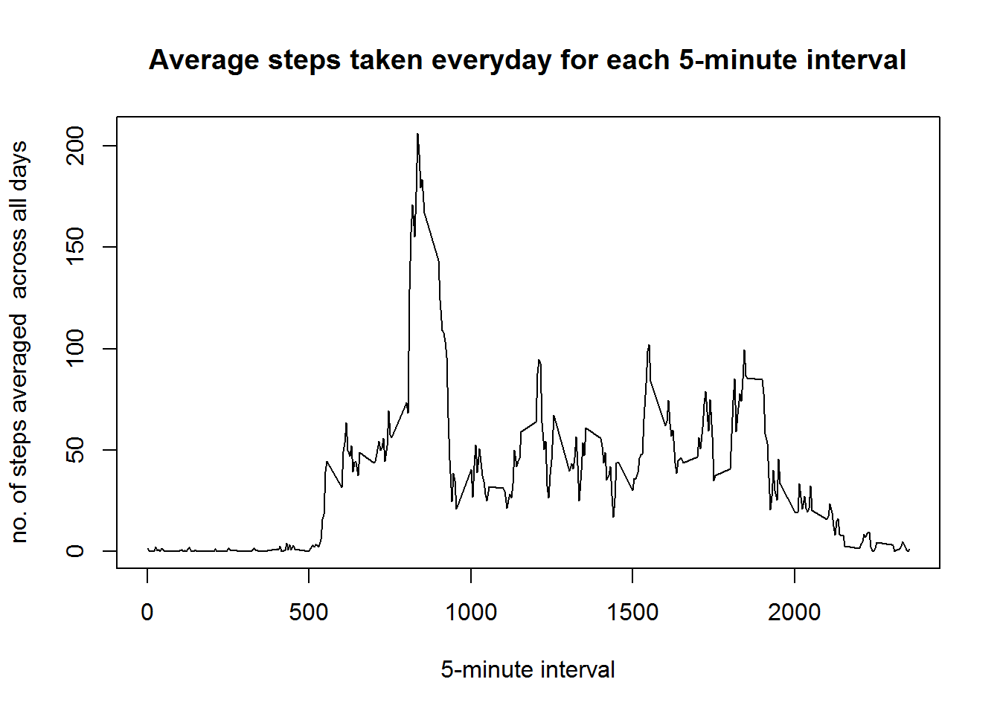
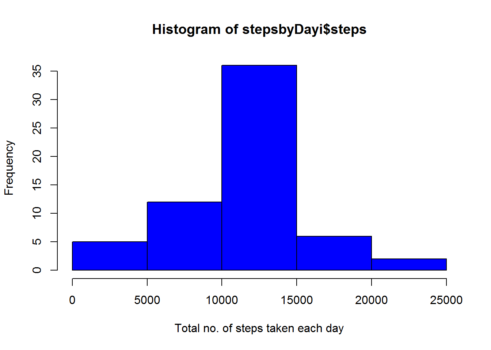
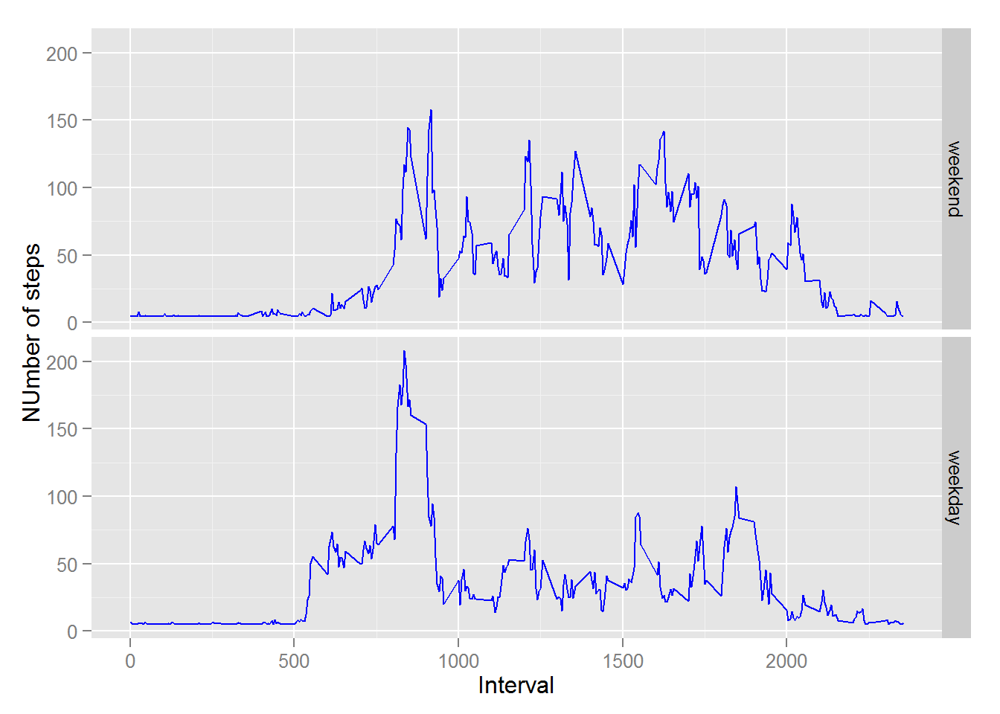

# Reproducible Research: Peer Assessment 1

```r
library(Hmisc)
```

```
## Loading required package: grid
## Loading required package: lattice
## Loading required package: survival
## Loading required package: Formula
## Loading required package: ggplot2
## 
## Attaching package: 'Hmisc'
## 
## The following objects are masked from 'package:base':
## 
##     format.pval, round.POSIXt, trunc.POSIXt, units
```

```r
library(ggplot2)
```


## Loading and preprocessing the data


```r
unzip('activity.zip')
data<-read.csv("activity.csv")
```


## What is mean total number of steps taken per day?


```r
stepsbyDay<- aggregate(steps ~ date, FUN = sum, data)

hist(stepsbyDay$steps,col = "red",main = "Total number of steps each day during October and November 2012",xlab = "Total steps")
```

 

```r
Mean<-mean(stepsbyDay$steps)
Median<-median(stepsbyDay$steps)
```

Mean is **1.0766189\times 10^{4}** and the median is **10765**.
## What is the average daily activity pattern?


```r
stepsbyInterval <- aggregate(steps ~ interval, data, mean)

plot(stepsbyInterval$interval,stepsbyInterval$steps, type="l", xlab="5-minute interval", ylab="no. of steps averaged  across all days",main="Average steps taken everyday for each 5-minute interval")
```

 

```r
Max_steps_interval <- stepsbyInterval[which.max(stepsbyInterval$steps),1]
```

The interval with maximum number of steps is **835**.

## Imputing missing values

```r
no_of_missing<-sum(!complete.cases(data))
```

No of missing values is **2304**


```r
new_data<-data
new_data$steps<-impute(new_data$steps,mean)
stepsbyDayi<- aggregate(steps ~ date, FUN = sum, new_data)

hist(stepsbyDayi$steps,xlab="Total no. of steps taken each day",main="For data with missing values filled",col="blue")
```

 

```r
Mean_imputed<-mean(stepsbyDayi$steps)
Median_imputed<-median(stepsbyDayi$steps)
diff1<-Mean_imputed-Mean
diff2<-Median_imputed-Median
steps_diff<-sum(stepsbyDayi$steps)-sum(stepsbyDay$steps)
```
The imputed mean and median are **1.0766189\times 10^{4}** and **1.0766189\times 10^{4}**  
Mean and meadian differences are 0 and 1.1886792

## Are there differences in activity patterns between weekdays and weekends?


```r
new_data$date <- as.Date(new_data$date)
weekdays <- c('Monday', 'Tuesday', 'Wednesday', 'Thursday', 'Friday')
new_data$wDay <- factor((weekdays(new_data$date) %in% weekdays),levels=c(FALSE, TRUE), labels=c('weekend', 'weekday'))

stepsbyInterval<-aggregate(steps ~ interval + wDay, new_data, mean)

ggplot(stepsbyInterval,aes(interval,steps))+geom_line(col="blue")+xlab("Interval")+ylab("NUmber of steps")+facet_grid(wDay ~ .)
```

 
